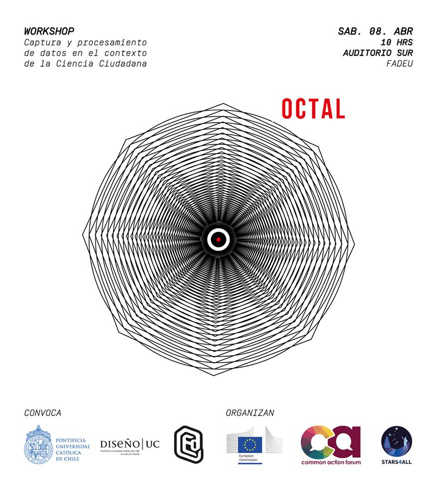

# Título 1
## Título 2
### Título 3
### Título 4

##### Insertar un link
[link](http://algo.com)

##### Insertar una imagen

##### Negrita
**algo**

##### Cursiva
*algo*

El texto puede ser escrito como en cualquier editor de texto.

Otra línea es un espacio (tab) que la separa de la anterior o posterior línea.

##### Tabla
|AlgoA|AlgoB|
|---|---|
|AlgoA|AlgoB|

##### Insertar mapa desde Carto
<iframe width="100%" height="520" frameborder="0" src="https://crishmill.carto.com/builder/15c0220e-16aa-11e7-b7f2-0e3ebc282e83/embed" allowfullscreen webkitallowfullscreen mozallowfullscreen oallowfullscreen msallowfullscreen></iframe>
