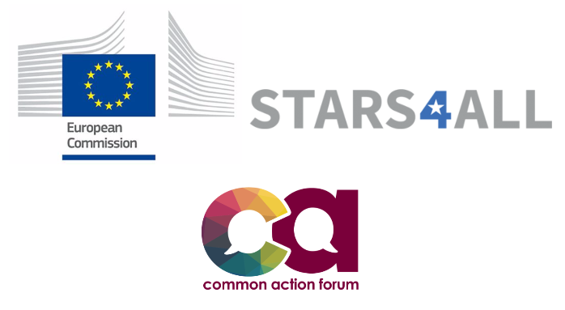

# Taller Octal

## 1. Descripción

### 1.1. Octal
Octal es un proyecto parte del programa *Stars4all* (stars4all.eu), el cual está financiado por la Unión Europea, y que busca crear conciencia sobre los efectos negativos de la polución lumínica alrededor del mundo a través de proyectos de ciencia ciudadana.

Además, Octal es parte de las iniciativas de Ciudadanía Digital de la fundación internacional *Common Action Forum* (CAF - commonactionforum.net), organización que busca la creación de plataformas globales de cooperación, investigación e innovación. Octal es parte en CAF del programa Liqen (liqenproject.org), a través del cual se investigan y visualizan controversias urbanas alrededor del mundo.

Octal tiene como objetivo crear una experiencia de juego para niños y jóvenes en edad escolar al interior de sus escuelas, en la cual se les invita a mirar los cielos de su ciudad buscando y midiendo cuántas estrellas pueden observar. Dichas observaciones serán compartidas a través de Internet con otros grupos de niños y jóvenes alrededor del mundo, con el fin de demostrar los distintos niveles de polución lumínica, generando conciencia y posibles soluciones al respecto.

### 1.2. Sobre el Taller
El taller Octal busca crear una instancia real de Ciencia de Datos Ciudadanos. En dicha experiencia a través del trabajo colaborativo se identificará la problemática a tratar, se escogerá un método y herramientas; se recopilarán datos a través de métodos de programación; se hará un procesamiento de bases de datos; y finalmente se visualizarán dichos datos, creando además un post del Blog que se montará para la experiencia, el cual será dispuesto en Internet para su acceso libre, como resultado del Taller.

El taller Octal cubrirá desde la pregunta de investigación realizada al interior de los mismos grupos, hasta la entrega de resultados al público en general.

## 2. Requisitos

### 2.1. Software y Plataformas

#### 2.1.1. Node.js
Para este taller trabajaremos usando el ambiente de programación **Node.js**, basado en Javascript y que permite trabajar desde el lado del servidor para la creación de aplicaciones.

Una de las ventajas de Node.js y que se base en Javascript, es que el mismo lenguage de programación podemos utilizarlo para configurar un servidor, crear una aplicación web y al mismo tiempo desarrollar visualizaciones.

> Instalar Node.js
- Para instalarlo en Windows puedes dirigirte [aquí](#).
- Para instalarlo en Mac puedes dirigirte [aquí](#).
- Para instalarlo en Linux puedes dirigirte [aquí](#).

> Las dudas de la instalación serán resueltas también el día del taller.

### 2.1.2. Editor de Texto
El editor de texto te permitirá leer y editar el código si es necesario. Te recomendamos encarecidamente que instales alguno de tu preferencia antes del talle. Algunas opciones son:

- [Notepad++](https://notepad-plus-plus.org/download/v7.3.3.html)
- [Sublime](https://sublimetext.com/3)
- [Atom](https://atom.io)

Cualquiera de las opciones es suficiente para este Taller.

#### 2.1.3. Carto
Si como resultado del análisis de cada grupo se escoge un mapa como visualización principal, o como parte del contenido creado, se utilizará el servicio gratuito **CARTO** ([link](https://carto.com/)). **Se recomienda crear una cuenta previamente a la asistencia al taller**. De todas formas el proceso es muy sencillo y rápido. Basta utilizar una cuenta de GMAIL para crear una cuenta.

#### 2.1.4. Google Drive
Es necesario que poseas una cuenta en **GMAIL**, con la cual acceder a Drive. Escribiremos texto y posiblemente utilizaremos Google Spreadsheets para el ejercicio.

### 2.2. Hardware
Necesitas un laptop para éste taller. Bastaría cualquier laptop con no menos de 5 años de antigüedad. Es posible que funcione todo OK en un laptop más antiguo, eventualmente. Aunque no podriamos asegurarlo... **;)**

### 2.3. Resumen de requerimientos para el taller:
- Laptop
- Node.js
- Editor de texto
- Cuenta en CARTO
- Cuenta en Google Drive

## 3. A quién está dirigido
Este taller esta dirigido a toda persona que desea participar de un taller introductorio al trabajo de ciencia ciudadana de datos. Dos tipos de perfil son los necesarios para éste taller:

a. Profesionales, estudiantes **sin** conocimientos de programación. Este curso si bien no es curso de programación, es posible comprender cómo se programa una aplicación y visualización.

b. Profesionales, estudiantes **con** conocimientos de programación. En este caso, aquellos profesionales que ya tengan un nivel intermedio o avanzado de programación podrán descrubrir cómo se llevan a cabo procesos de investigación con datos de forma abierta y colaborativa, en conjunto con el público en general.

## 4. Qué aprenderás en el Taller
- **Ciencia de Datos Ciudadanos**: corriente que mezcla metodologías cuantitativas y cualitativas de ciencia social para el desarrollo de proyectos científicos.
- **Ciencia de Datos**: a nivel básico e introductorio, pero podrás reconocer cómo se aplican técnicas de recolección y análisis de datos para fines diversos.
- **Programación**: a un nivel básico e introductorio, pero podrás al final del taller (copiando y pegando código), crear tu propia aplicación y/o visualización de datos.
- **Visualización de Datos**: a nivel básico e introductorio, podrás conocer cómo visualizar tus datos en plataformas abiertas y disponibles en la web.

## 5. Fechas y Lugares
Dos talleres serán realizados en Chile a principios del mes de Abril:

- **1 de Abril, 2017**: Facultad de Arquitectura y Urbanismo, Universidad de Chile. Desde las 10:00 a las 15:00 horas.
- **8 de Abril, 2017**: FabLab UC. Centro de Innovación UC Anacleto Angelini. Desde las 10:00 a las 15:00 horas.

Los cupos son limitados. Ojo.

## 6. Sobre el facilitador del Taller
[**Cristian Hernández**](http://crishernandez.co/): Geógrafo Universidad de Chile especializado en análisis de datos y visualización, con énfasis en datos espaciales y lenguaje natural. Lidera y participa en proyectos en Latinoamérica y Europa relacionados con Citizen Science, Semantic Web y Data Journalism. Su visita en Chile y busca explorar redes de colaboración para el proyecto Liqen-Octal, miembro de la iniciativa europea [Stars4All](http://stars4all.eu/), que busca proteger la oscuridad de los cielos nocturnos previniendo la polución lumínica y favoreciendo la libre observación del cielo.

## 7. Programa
Se entregará una guía con los detalles específicos a los participantes, pero en un principio el programa es el que sigue:

+ 10:00 - 10:10: Inicio y Bienvenida.
+ 10:10 - 10:30: Presentación Proyectos Ciencia Ciudadana de Datos (Cristian Hernández).
+ 10:30 - 11:30: Preparación de las Herramientas trabajo práctico.
+ 11:30 - 11:45: Creación de Grupos de trabajo.
+ 12:00 - 12:15: Escoger Método y Roles en el Equipo.
+ 12:15 - 13:40: Aplicación del Instrumento y Visualización.
+ 13:40 - 14:15: Interpretación Resultados y escritura del Artículo.
+ 14:15 - 15:00: *Carrousel* de resultados y finalización.

## 8. Octal es un proyecto auspiciado por:

##### Disclaimer
“This "paper/ presentation" is part of the Stars4ALL project that has received funding from the European Union’s Horizon 2020  under grant agreement No 688135"

---
##### Contacto:
Cristian Hernández Milla:  
cristian.hernandez@commonactionforum.net  
+44 7482237410 (United Kingdom)
